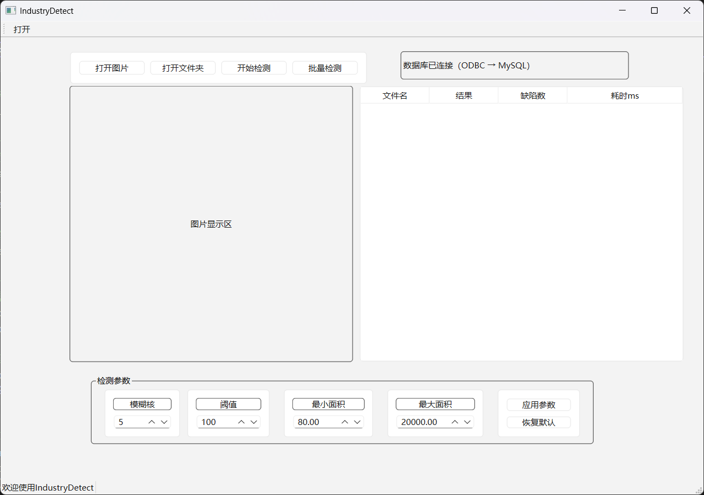
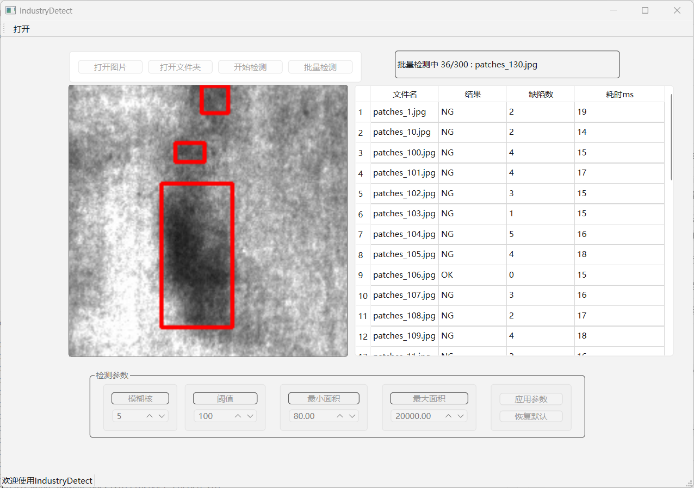
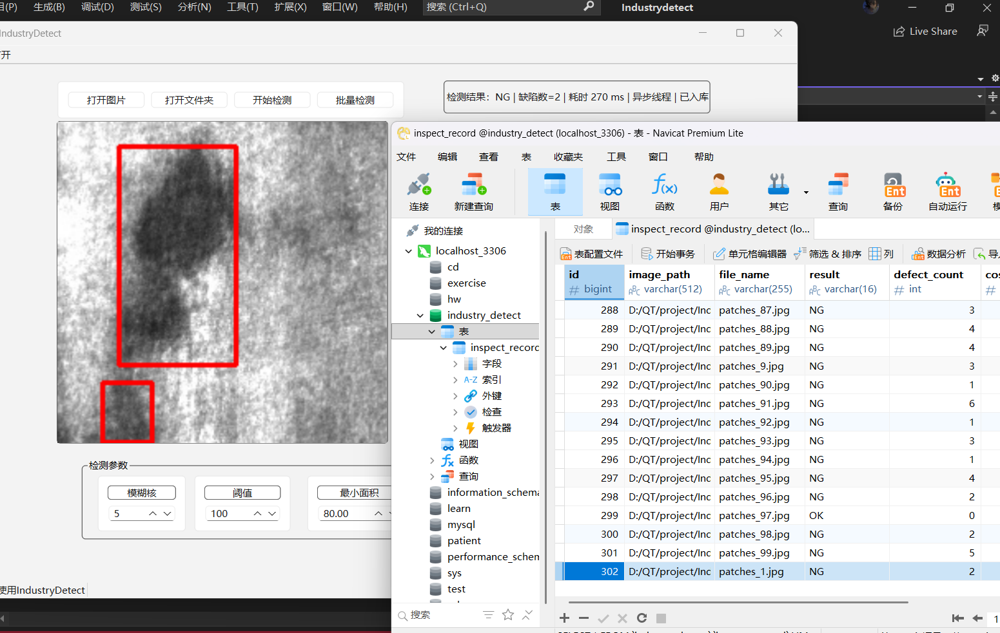

# IndustryDetect 工业表面缺陷检测上位机

基于 **Qt6 + OpenCV + MySQL** 的工业视觉检测 HMI Demo，用于实习/作品集展示。

面向场景：零件表面 **斑块（patches）** 缺陷的离线单张检测与文件夹批量复检；检测结果可写入 MySQL 做质量追溯。

> 本仓库为学习与演示项目：算法为传统 OpenCV 规则法（阈值 + 轮廓），不是深度学习检测器。

---

## 功能一览

| 功能 | 说明 |
|------|------|
| 单张检测 | 打开图片 → 后台线程检测 → 红框 + OK/NG（不写结果表） |
| 批量检测 | 选择文件夹 → 异步队列逐张检测 → 右侧表格记录，点击行可回看 |
| 参数配方 | 模糊核 / 阈值 / 最小最大面积可调；`QSettings` 本地记住 |
| 结果入库 | `QODBC` + MySQL ODBC → 表 `inspect_record` |

截图：把图片放到 docs/images/ 后取消下面注释





**演示视频 / GIF（可选）：** 录制 1～3 分钟操作流程后，把链接填在这里。

---

## 技术栈

- **C++ / Qt 6.11**（Widgets、信号槽、`QThread`、`QSettings`、Qt Sql）
- **OpenCV 5.x**（读图、预处理、轮廓、画框；工程默认链接 `opencv_world500`）
- **MySQL**（库 `industry_detect`，经 **ODBC Unicode 驱动** 连接）
- **Visual Studio 2022** + Qt VS Tools

---

## 架构说明（低耦合 / 高内聚）

```text
IndustryDetect.ui / IndustryDetect        ← 只做人机交互
        │
        ├─ InspectWorker + QThread        ← 异步检测，不卡界面
        │         │
        │         └─ InspectPipeline      ← 流程编排（检测 → 判定 → 填结果）
        │                   │
        │                   └─ PatchDetector   ← OpenCV 算法
        │
        ├─ ImageConverter                 ← Mat ↔ QImage
        └─ InspectDb                      ← MySQL 入库（窗口不写 SQL）
```

**面试可讲：**

- UI 与算法解耦：换 Detector 不必大改界面  
- 跨线程传图使用 `cv::Mat::clone()`，避免与 UI 抢同一块内存  
- 批量采用“完成一张再发下一张”的异步队列，而不是一次性堵死 UI  
- 配方本地持久化 + 结果落库追溯  

更细的模块说明见 [`docs/architecture.md`](docs/architecture.md)。

---

## 仓库结构

```text
Industrydetect/                 ← 解决方案根目录
├── README.md
├── .gitignore
├── Industrydetect.sln
├── docs/
│   ├── architecture.md         ← 架构说明
│   ├── images/                 ← 截图放这里（推仓库前自行添加）
│   └── sql/inspect_record.sql  ← 建表脚本
├── datasets/                   ← 演示图片（见下方说明）
├── third_party/opencv/         ← 本机 OpenCV（默认不纳入 Git，见环境要求）
└── Industrydetect/             ← 主工程源码
    ├── IndustryDetect.*        ← 主窗口
    ├── main.cpp
    ├── core/                   ← 类型、流水线、线程、图像转换
    ├── vision/                 ← PatchDetector
    └── output/                 ← InspectDb（数据库）
```

---

## 环境要求

1. Windows 10/11 **x64**
2. Visual Studio 2022（MSVC），已装 **Qt VS Tools**
3. Qt **6.11.x msvc2022_64**，模块：`core;gui;widgets;sql`
4. OpenCV（与 `Industrydetect.vcxproj` 中 include/lib 路径一致）  
   - 当前工程默认：`third_party/opencv/build/...`，`opencv_world500(d).lib`
5. MySQL 服务（本机 `3306`）
6. **MySQL Connector/ODBC（64 位）**，驱动程序名需与代码一致，例如：  
   `MySQL ODBC 26.7 Unicode Driver`  
   （在「ODBC 数据源(64 位) → 驱动程序」中查看；若版本名不同，请改 `output/InspectDb.cpp` 连接串）
7. Qt 运行目录能加载 `plugins/sqldrivers/qsqlodbc.dll`

---

## 数据库准备

1. 创建数据库：`industry_detect`
2. 执行建表脚本：[`docs/sql/inspect_record.sql`](docs/sql/inspect_record.sql)
3. 默认连接（**仅本地演示**）：
   - 主机 `127.0.0.1`，端口 `3306`
   - 用户 / 密码：见 `Industrydetect/output/InspectDb.cpp` 中的连接串  
   - **公开仓库前请改成你自己的账号，或改为读配置文件；勿把生产密码写进文档**

用 Navicat / 命令行执行 `SELECT * FROM inspect_record;` 能通即可。

---

## 编译与运行

1. 打开 `Industrydetect.sln`
2. 配置选 **Debug | x64**（或 Release | x64）
3. 确认：
   - Qt 安装名、模块含 `sql`
   - OpenCV 的 include / lib / 运行时 PATH（或把对应 `dll` 放到 exe 旁）
   - Debug 环境变量里 PATH 需同时包含 OpenCV bin **和** Qt dll 路径（两行 `PATH=` 会互相覆盖，应写在同一行）
4. 启动 **MySQL**，确认 ODBC Unicode 驱动已安装
5. 生成并运行
6. 打开演示图目录（默认对话框指向）：  
   `datasets/patches_demo/images`  
   →「开始检测」→ 状态栏出现结果；单张成功时带「已入库」  
7. 在 Navicat 中刷新 `inspect_record` 查看记录

### 数据集说明

演示数据建议使用 **NEU-DET** 中 patches 子集，放到：

```text
datasets/patches_demo/images/*.jpg
```

若仓库未包含全部图片，请自行下载后按上述目录放置。请勿把超大原始数据集强行推进 Git。

---

## 使用说明（操作路径）

1. **单张：** 打开图片 →（可选）调左侧参数并点「应用参数」→ 开始检测  
2. **批量：** 打开文件夹 → 批量检测 → 点表格行回看结果图  
3. **参数：** 退出时自动 `QSettings` 保存；下次启动恢复  

---

## 后续计划

- [ ] 界面查询最近 N 条检测记录  
- [ ] 导出 CSV  
- [ ] Modbus / TCP 上报 OK·NG（可选）  
- [ ] 工业相机取流（可选）  

---

## License

MIT License（可按需要自行更换）
